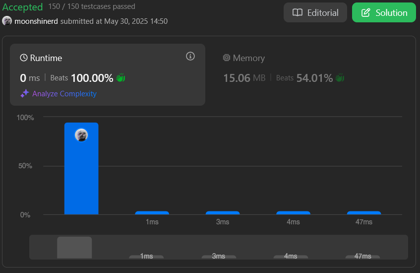

# LeetCode

**Número da Lista**: 3 
**Conteúdo da Disciplina**: Algoritmos Ambiciosos  

## Alunos
|Matrícula | Aluno |
| -- | -- |
| 22/2006178 | Thales Henrique Euflauzino dos Santos  |
| 22/2021924 | Víctor Hugo Lima Schmidt               |

## Sobre 
Para explorar o conteúdo do tópico de Algoritmos Ambiciosos, a dupla escolheu três exercícios na plataforma online [LeetCode](https://leetcode.com/): dois de nível difícil e um de nível médio.

## Screenshots

### [330. Patching Array](https://leetcode.com/problems/patching-array/)

### [435. Non-overlapping Intervals (Média)](https://leetcode.com/problems/non-overlapping-intervals/)

https://github.com/user-attachments/assets/c646797c-5c13-4468-ba4d-287dab6b0b80

### [630. Course Schedule III (Difícil)](https://leetcode.com/problems/course-schedule-iii/)

https://github.com/user-attachments/assets/2db3ffaf-6f8a-4593-9388-0af1e6a2169f

## Instalação 
**Linguagem**: JavaScript, Python e C++ 
